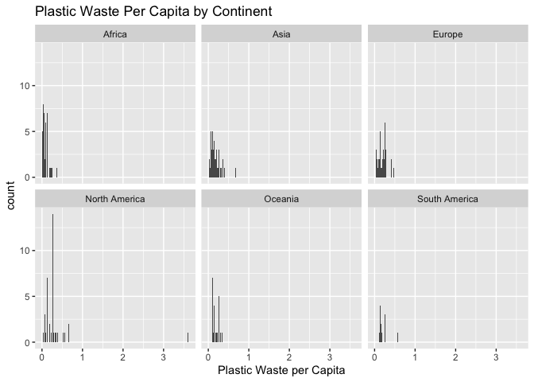
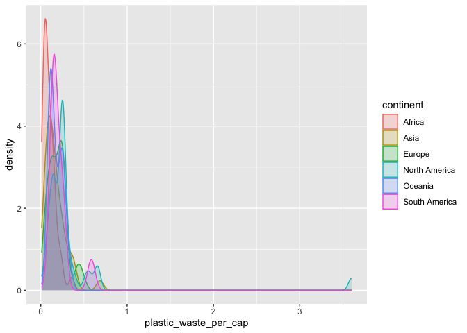
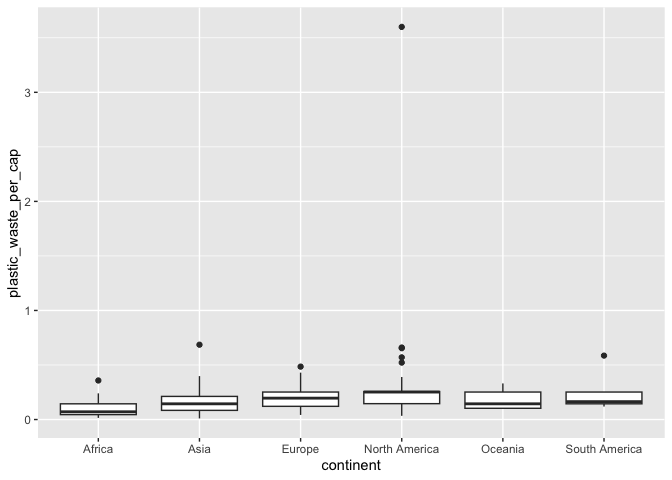
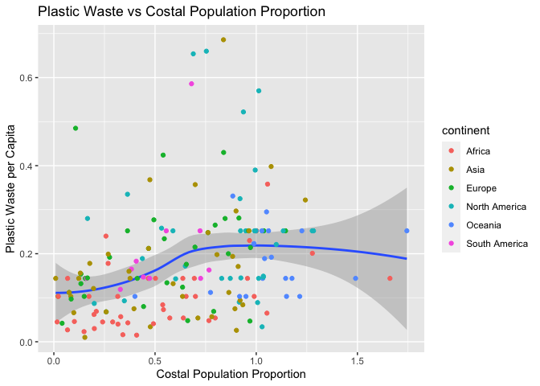

Lab 02 - Plastic waste
================
Lindsay Stall
01/20/2023

## Load packages and data

``` r
library(tidyverse) 
```

``` r
plastic_waste <- read.csv("data/plastic-waste.csv")
```

## Exercises

### Exercise 1.1

``` r
ggplot(data = plastic_waste, aes(x = plastic_waste_per_cap)) +
  geom_histogram(binwidth = .02) +
  labs(
    x = "Plastic Waste per Capita",
    title = "Plastic Waste Per Capita by Continent"
  ) +
facet_wrap(~ continent, nrow = 2) 
```

    ## Warning: Removed 51 rows containing non-finite values (`stat_bin()`).

<!-- -->

North America has the greatest variance in plastic waste per capita.

### Exercise 2.1

``` r
ggplot(data = plastic_waste, 
       mapping = aes(x = plastic_waste_per_cap, 
                     color = continent, 
                     fill = continent)) +
  geom_density(alpha = 0.2)
```

    ## Warning: Removed 51 rows containing non-finite values (`stat_density()`).

<!-- -->

Exercise 2.2: We defined the color and fill of the curves by mapping
aesthetics of the plot because they are a function of the variable,
continent. We defined the alpha level, however, as a characteristic of
the plotting geom because alpha level does not change a function of the
value of a variable (e.g., all continents have the same alpha leveL).

### Exercise 3.1

``` r
ggplot(data = plastic_waste, 
       mapping = aes(x = continent, 
                     y = plastic_waste_per_cap)) +
  geom_boxplot()
```

    ## Warning: Removed 51 rows containing non-finite values (`stat_boxplot()`).

<!-- -->

``` r
ggplot(data = plastic_waste, 
       mapping = aes(x = continent, 
                     y = plastic_waste_per_cap)) +
geom_violin()
```

    ## Warning: Removed 51 rows containing non-finite values (`stat_ydensity()`).

<!-- -->

Unlike a box plot, the violin plot presents a distribution of data such
that we can actually see the shape of the data. Box plots are more
simplified, but do provide some information that violin plots do not:
for example, the dots on the box plot represent outliers, whereas there
are not dots to represent outliers in violin plots.

### Exercise 4.1 - 4.3

``` r
ggplot(data = plastic_waste, aes(x = mismanaged_plastic_waste_per_cap, y = plastic_waste_per_cap)) +
  geom_point()
```

    ## Warning: Removed 51 rows containing missing values (`geom_point()`).

<!-- -->

``` r
ggplot(data = plastic_waste, 
       aes(x = mismanaged_plastic_waste_per_cap, 
           y = plastic_waste_per_cap,
       color = continent)) +
  geom_point()
```

    ## Warning: Removed 51 rows containing missing values (`geom_point()`).

<!-- -->

``` r
ggplot(data = plastic_waste, 
       aes(x = total_pop, 
           y = plastic_waste_per_cap)) +
  geom_point()
```

    ## Warning: Removed 61 rows containing missing values (`geom_point()`).

<!-- -->

``` r
ggplot(data = plastic_waste, 
       aes(x = coastal_pop, 
           y = plastic_waste_per_cap)) +
  geom_point()
```

    ## Warning: Removed 51 rows containing missing values (`geom_point()`).

<!-- -->

Plastic waste per capita and coastal population appear to be more
strongly linearly associated.

### Exercise 5.1

``` r
df<- filter(plastic_waste, plastic_waste_per_cap < 3)
```

``` r
ggplot(data = df, 
       aes(x = coastal_pop/total_pop, 
        y = plastic_waste_per_cap)) +
  labs(
    x = "Costal Population Proportion",
    y = "Plastic Waste per Capita",
    title = "Plastic Waste vs Costal Population Proportion"
  ) +
  geom_smooth()+
  geom_point(aes(color = continent))
```

    ## `geom_smooth()` using method = 'loess' and formula = 'y ~ x'

    ## Warning: Removed 10 rows containing non-finite values (`stat_smooth()`).

    ## Warning: Removed 10 rows containing missing values (`geom_point()`).

<!-- -->
